# Physical Robot Firmware — Used vs. Unused Feature Map

Scope: only the code that actually runs **on the robot** — the RP2040
(MicroPython, `src/robots/`) and its onboard ESP32-S3 receiver
(C++/Arduino, `src/receiver/main.cpp` + `lib/SwarmProtocol/`). The
dongle (`src/dongle/`) and PC tools (`tools/`) are the control side, not
the robot, and are excluded.

Generated by reading every file in that scope directly (not from the
repo-wide graphify graph, which is stale relative to today's uncommitted
changes) and confirming "unused" claims with `grep` call-site counts
rather than guessing. Snapshot date: 2026-08-13.

## Legend

- 🟢 **USED** — on the live execution path today
- 🟡 **PARTIAL** — wired end-to-end but the thing that would trigger it never fires, or vice versa
- 🔴 **UNUSED / DEAD** — reachable code that nothing calls, or a runtime flag currently set to skip it

## Graph

```mermaid
flowchart TB
    subgraph RP["RP2040 — MicroPython (uart_controller.py + friends)"]
        direction TB
        SPEED_RX["🟢 MSG_SPEED receive\n(robot_uart.py)"]
        OPENLOOP["🟢 Open-loop target→power\n(ODOMETRY_ENABLED=False)"]
        CLOSEDLOOP["🔴 PI closed-loop control\n(PI class, pid_left/right.update)"]
        ENC["🟢 Encoder speed measurement\n(feeds display + dead PID path)"]
        MOTORS["🟢 motors.set_speeds()"]
        BATT["🟢 Battery sample → MSG_METRICS"]
        RGB["🟢 RGB LED green flash on batt report\n(uncommitted, new)"]
        SCR_MOTORS["🟢 MOTORS screen"]
        SCR_GRAPH["🟢 GRAPH screen (LineGraph)"]
        SCR_DEBUG["🟢 ESP DEBUG screen\n(dynamic, driven by ESP32)"]
        BUTTONB["🟢 Button B — cycle screens"]
        BARGRAPH["🔴 BarGraph class\n(screen_manager.py, never instantiated)"]
        GAUGE["🔴 Gauge class\n(screen_manager.py, never instantiated)"]
        SENDDEBUG["🔴 send_debug()\nRobot→PC log channel, 0 call sites"]
        ONRAW["🔴 on_raw hook\n(UARTProtocol, never wired)"]
        ENGINESOUND["🔴 EngineSound module\n(ENGINE_SOUND_ENABLED=False)"]
        BUZZER["🔴 Buzzer in swarm firmware\n(only stock main.py uses it)"]
        PING["🟢 MSG_PING heartbeat\n(RP2040↔ESP32 keepalive)"]
        ROBOTID["🟢 MSG_ROBOT_ID handling"]
        SPLASH["🟢 Stock Pololu splash_loader\n(entry point, delay just cut 6s→3s)"]
    end

    subgraph ESP["ESP32-S3 Receiver (main.cpp)"]
        direction TB
        ESPNOW["🟢 ESP-NOW transport +\ndongle MAC self-heal"]
        STATE["🟢 ANNOUNCING↔ACTIVE\nstate machine"]
        SWARM["🟢 MSG_SWARM parse →\nper-robot speed → UART"]
        PONG["🟢 MSG_PING/PONG latency"]
        TDMA["🟢 TDMA telemetry\n(MSG_TELEMETRY)"]
        WDG["🟢 Watchdog motor-stop\n(WATCHDOG_TIMEOUT_MS)"]
        KEEPALIVE["🟢 UART keepalive resend\n(200ms)"]
        DBGPING["🟢 MSG_DEBUG_PING →\nregister debug fields"]
        DBGRELAY["🟡 MSG_DEBUG relay\nto dongle (wired, but robot\nnever sends one)"]
        METRICSIN["🟢 MSG_METRICS ingest\n(battery)"]
        RXQ["🟢 SPSC RX ring buffer\n(core0→core1)"]
        LEDANIM["🔴 WS2812 rainbow logic\n(hsvToColor, hue) — hardcoded\nto always-off, 'TEMP' hack"]
        RSSI["🔴 DEBUG_FIELD_RSSI\n(TODO, blocked on ESP-IDF 5.x)"]
        LEDCONST["🔴 LED_ON_DURATION_MS\n(defined, zero references)"]
        DIAG["🟢 Serial diagnostics printf\n(dev aid, USB-conditional)"]
    end

    SPEED_RX --> OPENLOOP --> MOTORS
    SPEED_RX -.dead branch.-> CLOSEDLOOP
    ENC --> CLOSEDLOOP
    ENC --> SCR_GRAPH
    BATT --> RGB
    BATT --> SCR_MOTORS
    PING --> SCR_DEBUG
    ROBOTID --> SCR_MOTORS
    DBGPING -. UART .-> SCR_DEBUG
    SWARM -- UART MSG_SPEED --> SPEED_RX
    METRICSIN -. UART MSG_METRICS .-> BATT
    DBGRELAY -.would carry.-> SENDDEBUG

    classDef used fill:#1f6f43,stroke:#0f3d25,color:#fff
    classDef partial fill:#8a6d1f,stroke:#5c4a14,color:#fff
    classDef dead fill:#555,stroke:#333,color:#ddd,stroke-dasharray: 4 3
    class SPEED_RX,OPENLOOP,ENC,MOTORS,BATT,RGB,SCR_MOTORS,SCR_GRAPH,SCR_DEBUG,BUTTONB,PING,ROBOTID,SPLASH,ESPNOW,STATE,SWARM,PONG,TDMA,WDG,KEEPALIVE,DBGPING,METRICSIN,RXQ,DIAG used
    class DBGRELAY partial
    class CLOSEDLOOP,BARGRAPH,GAUGE,SENDDEBUG,ONRAW,ENGINESOUND,BUZZER,LEDANIM,RSSI,LEDCONST dead
```

## Detailed breakdown

### RP2040 — `src/robots/`

| Feature | File | Status | Notes |
|---|---|---|---|
| MSG_SPEED receive → target CPS | `robot_uart.py`, `uart_controller.py` | 🟢 USED | Core control path |
| Open-loop target→power mapping | `uart_controller.py` | 🟢 USED | `ODOMETRY_ENABLED = False` — steady-state per [[project_odometry_disabled]] |
| Closed-loop PID (`PI` class) | `uart_controller.py` | 🔴 UNUSED | Code intact, `pid_left/right.update()` computed but result discarded; only `.reset()` runs each tick |
| Encoder speed measurement | `uart_controller.py` | 🟢 USED | Feeds display/graph even with PID off |
| Battery sampling → `MSG_METRICS` | `uart_controller.py` | 🟢 USED | Every 2s |
| RGB LED battery-report flash | `uart_controller.py` | 🟢 USED | **Uncommitted** — added since last commit, green flash on each battery send |
| MOTORS / GRAPH screens | `uart_controller.py` | 🟢 USED | Both registered, cycled via Button B |
| ESP DEBUG screen | `robot_uart.py` | 🟢 USED | Populated dynamically by ESP32's `MSG_DEBUG_REG`/`MSG_DEBUG_DATA` (LAT/STA/ML/MR fields) |
| `BarGraph` class | `screen_manager.py` | 🔴 UNUSED | Defined, documented, zero instantiations anywhere |
| `Gauge` class | `screen_manager.py` | 🔴 UNUSED | Same — dead library code |
| `send_debug()` (Robot→PC log) | `robot_uart.py` | 🔴 UNUSED | Per [[project_msg_debug_channel]] this channel was added 2026-06-19 but **zero call sites** exist — the ESP32 relay and PC-side terminal display are wired, but nothing on the robot ever calls it |
| `on_raw` callback hook | `robot_uart.py` | 🔴 UNUSED | Constructor param, never passed a callback in `uart_controller.py` |
| `EngineSound` module | `engine_sound.py` | 🔴 UNUSED | `ENGINE_SOUND_ENABLED = False`; import is skipped entirely; per [[project_engine_sound_feature]] added 2026-06-18, untested on hardware |
| Buzzer in swarm firmware | — | 🔴 UNUSED | Confirmed no `buzzer.` call in `uart_controller.py`; only the **stock, unmodified** `main.py` splash loader plays a startup chime / error beep |
| Stock Pololu `main.py` splash | `main.py` | 🟢 USED | Actual entry point; delay just tuned down (6s→3s wait, 700ms→200ms launch flash) — uncommitted |
| `flash.py` batch-deploy tool | `tools/flash.py` | 🟡 UNVERIFIED | PC-side deploy helper, not robot firmware; README says "not yet verified against real hardware" and even points at the wrong path (`src/robots/flash.py`) |

### ESP32-S3 Receiver — `src/receiver/main.cpp`

| Feature | Status | Notes |
|---|---|---|
| ESP-NOW transport + dongle MAC self-heal | 🟢 USED | Core wireless link |
| ANNOUNCING↔ACTIVE state machine | 🟢 USED | |
| `MSG_SWARM` → per-robot speed → UART | 🟢 USED | Core control path |
| `MSG_PING`/`MSG_PONG` latency echo | 🟢 USED | Feeds dongle's `pingTracker` and the robot's own debug LAT graph |
| TDMA telemetry (`MSG_TELEMETRY`) | 🟢 USED | Battery/status/motor/uptime, one slot per `ROBOT_ID` |
| Watchdog motor-stop | 🟢 USED | Independent of PC/dongle link health, per project safety design |
| UART keepalive resend (200ms) | 🟢 USED | |
| `MSG_DEBUG_PING` → register debug fields | 🟢 USED | Triggers `DebugScreen::registerAllFields` + robot-ID push |
| `MSG_DEBUG` relay to dongle | 🟡 PARTIAL | Correctly implemented and would forward a robot log line to `swarm_terminal` — but since `send_debug()` on the RP2040 is never called, this path currently carries zero traffic |
| `MSG_METRICS` ingest (battery) | 🟢 USED | |
| SPSC RX ring buffer (core0→core1) | 🟢 USED | |
| WS2812 RGB LED animation (`hsvToColor`, `hue` rainbow) | 🔴 DEAD | `updateRgbLed()` computes/accepts `hue`/`announcing` but immediately discards them and hardcodes `Color(0,0,0)` — comment says `// TEMP: maximum white for ArUco readability testing`, but the code actually forces the LED **off**, not white. Stale hack, LED effectively disabled. |
| `DEBUG_FIELD_RSSI` | 🔴 NOT BUILT | `TODO` comment only, blocked on ESP-IDF 5.x (`esp_now_recv_info_t`) |
| `LED_ON_DURATION_MS` (`hardware.h`) | 🔴 ORPHANED | Defined, zero references anywhere in the codebase |
| Serial diagnostics (`printf`) | 🟢 USED | Dev aid, gated on `if (Serial)` so it's free when no USB host is attached |

## Recommendations for the rework

**Safe to delete outright** (no dependents, confirmed dead by grep):
- `BarGraph` and `Gauge` classes in `screen_manager.py`
- `on_raw` parameter/plumbing in `UARTProtocol`
- WS2812 rainbow logic in the receiver's `updateRgbLed()`/`hsvToColor()` — replace with either nothing, or a real status LED (announcing/active/error color) since the hardware is already there and wired
- `LED_ON_DURATION_MS` in `hardware.h`

**Decide, then act** (built but disconnected — pick one direction):
- Closed-loop PID (`PI` class + `ODOMETRY_ENABLED`): either commit to open-loop permanently and delete the PID class + encoder-driven measurement that only exists to feed it, or actually re-enable and tune it. Right now you're paying the encoder-read cost every tick for a control mode that's off.
- `send_debug()` / `MSG_DEBUG` relay: the whole pipe (RP2040 → ESP32 → dongle → `swarm_terminal`) is built and correctly wired end-to-end except for the one call that would use it. Either wire a real call site (e.g. log watchdog trips, CRC errors) or strip the channel from all three protocol implementations (`protocol.h`, `SwarmClient.h`, `robot_uart.py`) per the project's "keep the wire protocol in sync by hand" constraint.
- `EngineSound`: untested on hardware. Either bring a robot to the bench and validate it, or drop the module — it's fully isolated (`ENGINE_SOUND_ENABLED` flag, own file) so removal is a one-file delete + one flag/import removed from `uart_controller.py`.

**Keep as-is:**
- Everything marked 🟢 above — this is the actual live control/telemetry/display loop and safety watchdog.

---
★ Insight ─────────────────────────────────────
Three of the dead-code findings above (`BarGraph`/`Gauge`, `on_raw`, `LED_ON_DURATION_MS`) are the classic "library grew ahead of its callers" pattern — `screen_manager.py` and `robot_uart.py` are written as small reusable libraries with documented APIs, so they naturally accumulate options no caller has needed yet. That's different from the WS2812 rainbow code, which *was* used (the git history implies an ArUco-readability experiment) and is now a stale leftover — a `// TEMP` comment that outlived the change it described. Worth distinguishing "never finished" from "finished, then abandoned" when deciding what to delete vs. what to finish.
─────────────────────────────────────────────────
